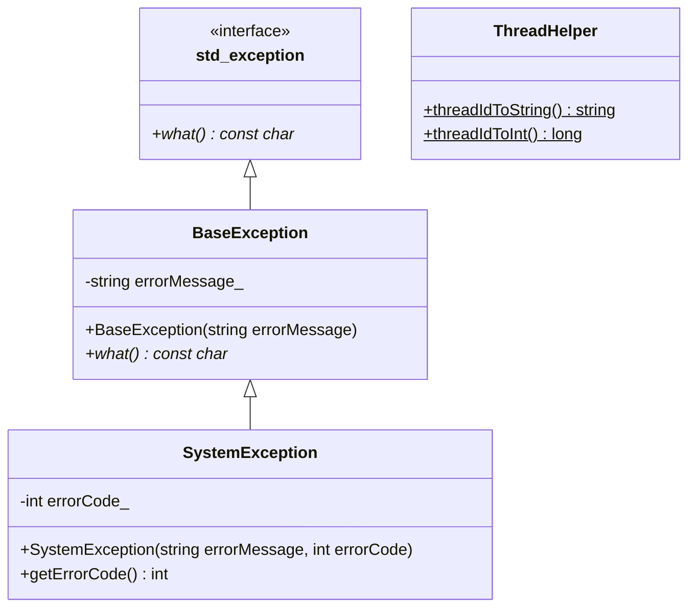
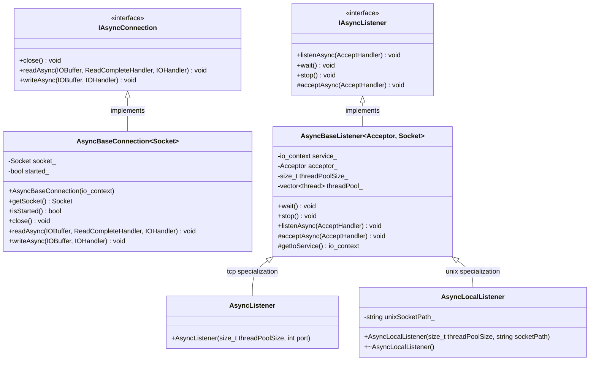
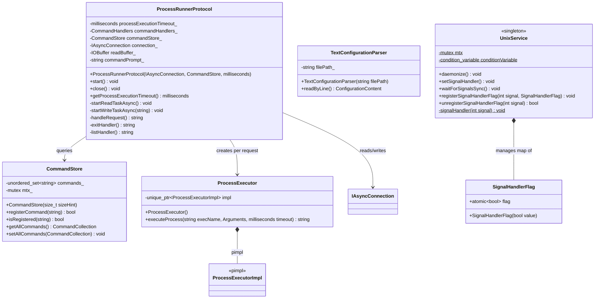
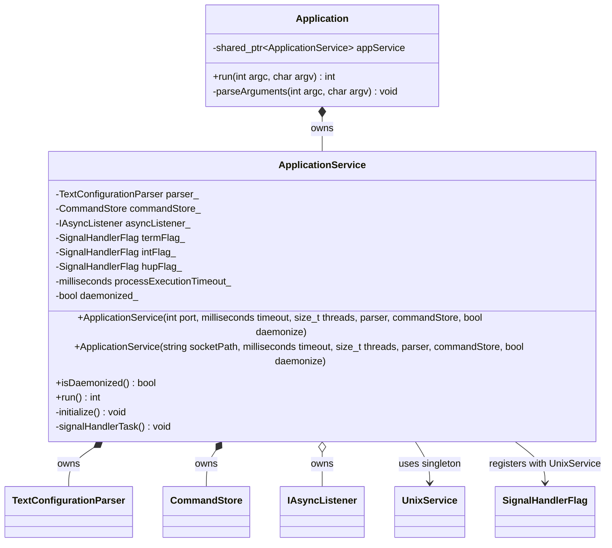
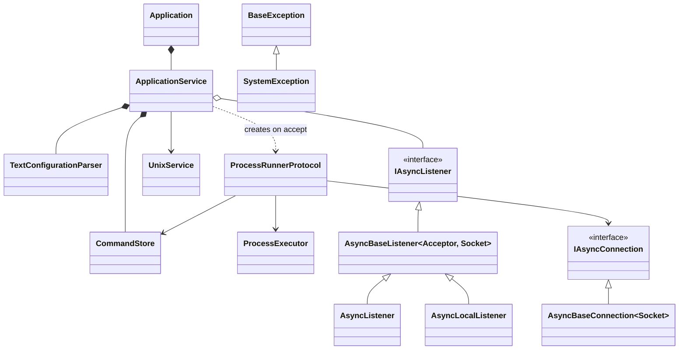

# Class Diagrams

## 1. Core Module

---

## 2. Network Module

**Type aliases defined in `IAsyncConnection.hpp`:**

| Alias | Type |
|---|---|
| `Byte` | `uint8_t` |
| `IOBuffer` | `vector<Byte>` |
| `IOHandler` | `function<void(error_code, size_t)>` |
| `ReadCompleteHandler` | `function<size_t(error_code, size_t)>` |
| `AcceptHandler` | `function<void(IAsyncConnection::Ptr, error_code)>` |

---

## 3. Common Module

---

## 4. Server Module

---

## 5. Full System — Cross-Module Relationships

